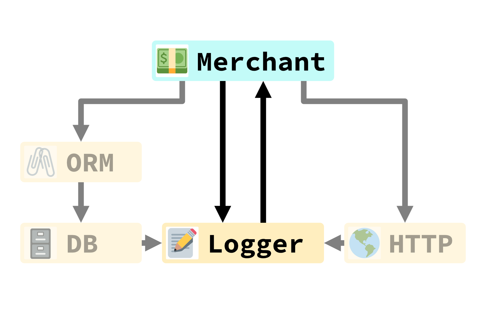
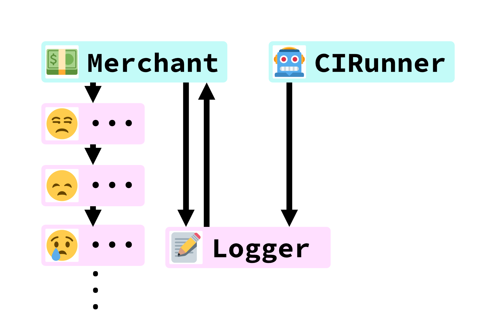
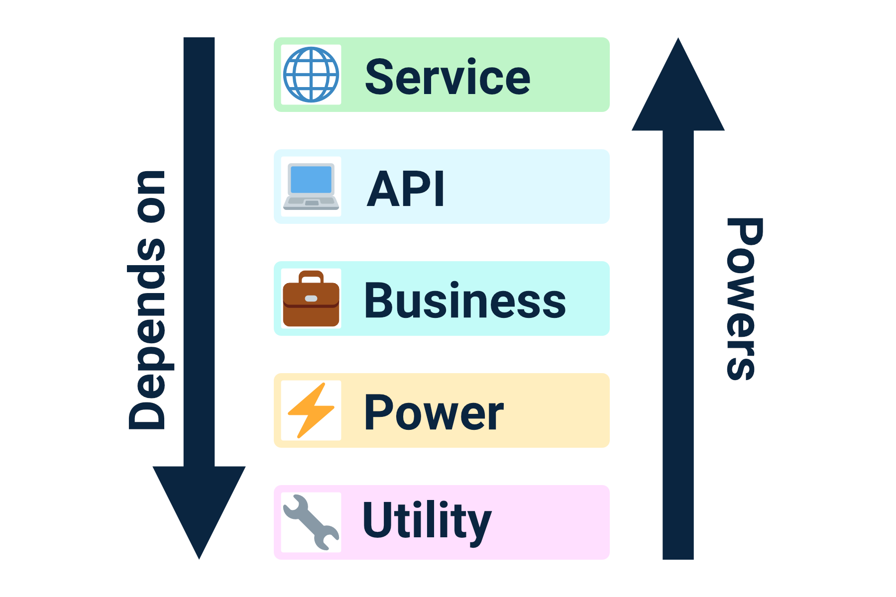
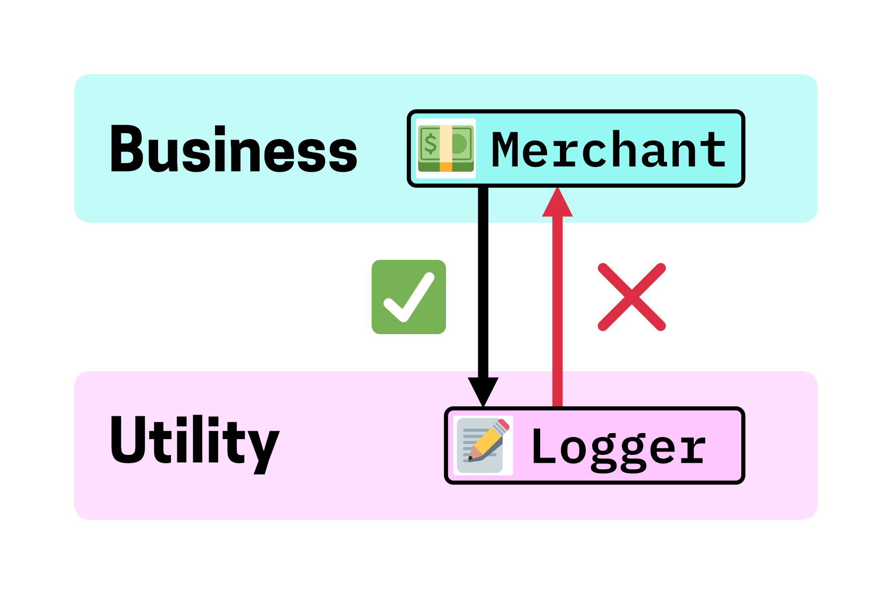

-----

<h1 class="title">Refactoring Large, Stubborn Codebases</h1>

::::{.columns}
:::{.column width="27%"}
Jake Zimmerman\
Getty D. Ritter
:::
:::{.column width="73%"}
![][github-mark-light]![][github-mark-dark][`@jez`]\
![][github-mark-light]![][github-mark-dark][`@aisamanra`]
:::
::::

[November 19, 2024]{.date}

[`@jez`]: https://github.com/jez
[`@aisamanra`]: https://github.com/aisamanra
[github-mark-light]: img/light/github-mark.svg {style="height:30px; margin: 0 0.3em -5px;"}
[github-mark-dark]: img/dark/github-mark.svg {style="height:30px; margin: 0 0.3em -5px;"}

-----

## Complaints about stubborn codebases

- _Our code isn't modular enough!_

::: incremental

- _This dependency is 10 years out of date!_

- _We need to change how we talk to the database!_

- ...

:::

. . .

### → We can refactor to a happy state!

## Best to centralize the refactor ☀️

Have **one team** drive the refactor:

* **concentrates expertise**\
  most problems will be repeat problems

- **incentivizes automation**\
  fewer man-hours overall

- **avoids idle time**\
  no need to wait for each team to plan and prioritize

## Centralized migration needs two things:

<!-- TODO(jez) Better diagrams -->

:::: {.columns}
::: {.column width="45%"}
**Leverage** over the codebase


:::

::: {.column width="55%"}
Way to **ratchet** incremental progress

{height="180px"}
:::
::::

##

\

::::{.columns style="gap: min(4vw, 0.5em);"}
:::{.column style="width:20%; text-align:right;"}
To \
you need to\
and to
:::
:::{.column width="80%"}
**refactor a large, stubborn codebase**\
**have a point of leverage**\
**pick good ratchets**.
:::
::::

\

## Agenda 🎯

\

- **Improving developer satisfaction with Sorbet**

- Making a Ruby monolith more modular

\

## {background-image="/img/sorbet.org.png"}

## 🥺 Stripe's developers were unhappy

::::{.columns}
:::{.column width="46%" }
"hard to understand"\
["waiting for tests is slow"]{.fragment}\
["only breaks in production"]{.fragment}\
["don't trust the docs"]{.fragment}\
["too much low-quality code"]{.fragment}
:::
:::{.column width="54%"}
&nbsp;\
&nbsp;\
&nbsp;\
&nbsp;\
&nbsp;
:::
::::

(sentiment from company-wide survey)

## 💡 Building Sorbet introduced leverage

::::{.columns}
:::{.column width="46%" }
"hard to understand"\
"waiting for tests is slow"\
"only breaks in production"\
"don't trust the docs"\
"too much low-quality code"
:::
:::{.column width="54%"}
[**→** IDE aids understanding]{.fragment}\
[**→** all code type checks in seconds]{.fragment}\
[**→** type checker catches bugs in CI]{.fragment}\
[**→** runtime makes types trustworthy]{.fragment}\
[**→** bad code is hard to type]{.fragment}
:::
::::

(sentiment from company-wide survey)

## Brief history of Sorbet 👨‍🏫

- Began fall 2017
- Stripe: **\~800** employees (200 -- 400 engineers)
- Initial project: 3 engineers, full time

Timeline

- **9 months** to build Sorbet...\
  ... but has served as the foundation for hundreds of
  codemods
- **3 months** to get to 75% adoption...\
  ...contained to just three engineers

## Aside: you can do it too!

Tools that you can use to bootstrap something:

- [ESLint], [RuboCop], your language's linter
- [Clang compiler plugins], [C# static analyzers], [go analysis package]
- BYO: tree-sitter parsers, LSP server libraries, ...
- GitHub code search for example projects using these tools

[ESLint]: https://eslint.org/
[RuboCop]: https://rubocop.org/
[Clang compiler plugins]: https://clang.llvm.org/docs/ClangPlugins.html
[C# static analyzers]: https://learn.microsoft.com/en-us/dotnet/csharp/roslyn-sdk/tutorials/how-to-write-csharp-analyzer-code-fix
[go analysis package]: https://pkg.go.dev/golang.org/x/tools/go/analysis

## Ratcheting with `# typed` comments

**`# typed`** comment at the top of each file

::::{.columns}
:::{.column width="30%"}
`# typed:` **`false`**\
`# typed:` **`true`**\
`# typed:` **`strict`**
:::
:::{.column width="70%"}
→ just syntax and constants\
→ inference in methods\
→ every method needs a signature
:::
::::

## `typed:` **`false`** → **`true`**

<iframe
  style="width: 100%; height: 400px;"
  src="https://sorbet.run/#%23%20typed%3A%20ignore%0A%0Abegin%0A%20%20File.open%28%22%2Fetc%2Fhosts%22%29%20do%20%7Cf%7C%0A%20%20%20%20f%20%3C%3C%20%22example%22%0A%20%20end%0Arescue%20IoError%0A%20%20STDERR.log%28%22failed%20to%20write%20to%20host%20file!%22%29%0Aend"
></iframe>

## 💡 **local**, **incremental**, and **actionable**

Alternatives to `# typed:` comment:

- by folder → too broad\
  (not local enough, not incremental enough)

- by coverage percent → too granular\
  (noisy, hard to action)

## **actionable** = high **signal**, low noise

<iframe
  style="width: 100%; height: 400px;"
  src="https://sorbet.run/#%23%20typed%3A%20true%0A%23%20%20%20%20%20%20%20%20%5E%20start%20with%20false%0A%0Aclass%20KnownParent%0A%20%20def%20method_on_parent%28x%29%3B%20end%0Aend%0A%0Aclass%20MyClass%20%3C%20UnknownParent%0A%20%20def%20example%0A%20%20%20%20self.method_on_parent%28%29%0A%20%20end%0Aend"
></iframe>

##

Developer satisfaction improved because

::::{.columns style="gap: min(4vw, 0.5em);"}
:::{.column style="width:6%; text-align:right;"}
we \
by\
and
:::
:::{.column width="94%"}
**refactored a large, stubborn codebase**\
**having a point of leverage** (Sorbet)\
**picking good ratchets** (`# typed:`)
:::
::::


## Agenda 🎯

\

- Improving developer satisfaction with Sorbet

- **Making a Ruby monolith more modular**

\


## Why do we need modularity?

## Simple example

```ruby
# a toy logger
class Logger
  def log(message, **storytime)
    payload = storytime.map do |k, v|
      "#{k}=#{v.inspect}"
    end.join(" ")

    @output.puts("#{Time.now.to_i}: ${message} #{payload}")
  end
end
```

## Simple example

```ruby
# elsewhere
logger.log("Attempting operation", op: my_op, merchant: m)
# 1730756308: Attempting operation op=:update merchant=#<Merchant id=22 secret="hunter2">
```

## Simple example

```ruby
    # ...
    payload = storytime.map do |k, v|
      if v.is_a?(Merchant)  # if we're logging a merchant...
        "#{k}=Merchant(id=#{v.id}, ...)"  # redact most fields
      else
        "#{k}=#{v.inspect}"  # other objects can be logged as-is
      end
    end.join(" ")
    # ...
```

## Simple example

```{.ruby .hl-3}
    # ...
    payload = storytime.map do |k, v|
      if v.is_a?(Merchant)  # if we're logging a merchant...
        "#{k}=Merchant(id=#{v.id}, ...)"  # redact most fields
      else
        "#{k}=#{v.inspect}"  # other objects can be logged as-is
      end
    end.join(" ")
    # ...
```

## Well-intentioned changes can produce tangled code

:::: {.columns}
::: {.column style="text-align: center;"}
{height="360px"}
:::
::::

## ...and tangled code has non-local effects!

:::: {.columns}
::: {.column style="text-align: center;"}
{height="360px"}
:::
::::

## Why do we need modularity?

Tangled code is...

- difficult to **debug**
- difficult to **test**
- prone to **larger deploy artifacts**
- prone to **higher memory usage**

A drag on both **developer velocity** and **runtime performance**

## Point of leverage: packaging

```ruby
# lib/logger/__package.rb
class Logger < PackageSpec
  import Merchant

  export Logger
end

# lib/merchant/__package.rb
class Merchant < PackageSpec
  import Logger

  export Merchant
end
```

## Point of leverage: layering

> The essential principle is that any element of a layer depends only on other elements in the same layer or on elements of the layer ’beneath’ it. Communication upward must pass through some indirect mechanism.

---Eric Evans, **Domain-Driven Design: Tackling Complexity in the Heart of Software**

## Point of leverage: layering
:::: {.columns}
::: {.column style="text-align: center;"}
{height="320px"}
:::
::::

## Point of leverage: layering
:::: {.columns}
::: {.column style="text-align: center;"}
{height="320px"}
:::
::::

## Point of leverage: layering

```{.ruby .hl-3}
class Logger < PackageSpec
  layer 'utility'
  import Merchant # <- ill-layered import!
  export Logger
end

class Merchant < PackageSpec
  layer 'business'
  import Logger
  export Merchant
end
```

## Building a ratchet: `strict_dependencies`

* `strict_dependencies` **`'false'`**
* `strict_dependencies` **`'layered'`**
* `strict_dependencies` **`'dag'`**

## ...and then use the ratchet!

Important to have:

- a **reason to refactor**
- **comprehensive documentation**
- **targeted tooling**
- **organizational support**


##

Developer velocity and production latency improved because

::::{.columns style="gap: min(4vw, 0.5em);"}
:::{.column style="width:6%; text-align:right;"}
we \
by\
and
:::
:::{.column width="94%"}
**modularized a large, stubborn codebase**\
**having a point of leverage** (packages and layering)\
**picking good ratchets** (`strict_dependencies`)
:::
::::

## What makes a good ratchet?

- **local**
  - Sorbet: per-file
  - Dependencies: per-package
- **incremental**
  - Sorbet: `false` to `true` to `strict`
  - Dependencies: `false` to `layered` to `dag`
- **actionable**
  - Sorbet: "Where do I need types in my current files?"
  - Dependencies: "What bad edges can I remove from my current package?"

## Successful codebase-wide refactors

* Find **points of leverage**
* Build **clear, enforceable ratchets**
* Staff a **focused and supported team**
* (...and have patience: **it's hard work!**)

## Questions?

<!--
Note: the last slide will be the one with the Stripe
logo, so let's be sure to have a "questions" slide last to
make the logo show up, or be sure to tweak the CSS to get
the Stripe logo background to show up on whatever relevant
slides too.
-->


<!-- vim:tw=60
-->
